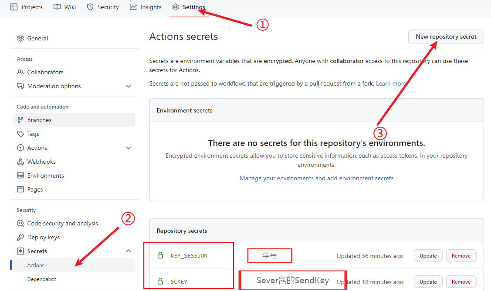
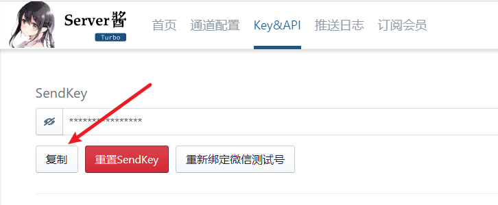

# 第二课堂网络学习刷分脚本
## 原理：
使用微信小程序要等待五分钟才能答题，为了突破此限制，直接向抓包获取的接口提交所有可能的答案组合(A,B,C,D,AB,AC...)  
* 需要输入学号，不需要输入密码
* 由于系统限制，每天只能刷两个思政学分，
* 可以用`gthub action`或者`云函数`每天定时执行
# 修改部分
1. * 定时设置  

#### 注意：图中第二位数字“小时”为UTC标准，也就是说——UTC时+8小时=北京时间
2. * secrets设置（方便使用）  
| Secrets 名称|Secrets 内容|  
| ----------------| ------------------|  
| KEY_SESSION  |       学   号              |  
| SCKEY                    | Server 酱的 KEY |        

设置后完成学习可推送至微信  

3. * Server酱的KEY获取地址
[Server酱](https://sct.ftqq.com)  
复制获得的KEY  

